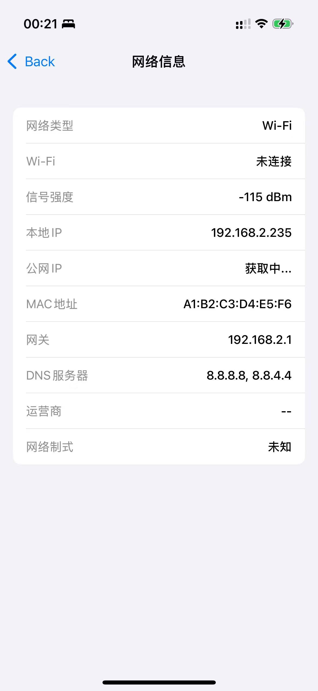

# 📱 PhoneManager

  

  
  
  
  

## 🌟 特性

PhoneManager 是一款功能强大的 iOS 设备信息管理工具，提供实时的设备状态监控和丰富的传感器数据展示。

### 🔄 网络监控
- 实时显示上传/下载速度
- 网络流量统计（日/月）
- 当前网络状态监测
- WiFi 信号强度显示

### 📊 设备信息
- CPU/内存使用率
- 存储空间分析
- 电池状态监控
- 设备型号识别

### 🧭 传感器数据
- 实时指南针显示
- 加速度计数据
- 陀螺仪数据
- 环境光感应

## 📸 截图

  
  
  
  

## 🛠 技术特点

- 💻 使用 SwiftUI 构建现代化 UI
- 🔄 实时数据更新和监控
- 📱 原生 iOS API 集成
- 🎨 优雅的深色模式支持
- 📊 流畅的动画效果
- 🔋 低功耗设计

## 📦 系统要求

- iOS 16.0 或更高版本
- Xcode 14.0 或更高版本
- Swift 5.0

## 🚀 安装

1. 克隆仓库
git clone https://github.com/yourusername/PhoneManager.git

2. 打开项目
cd PhoneManager
open PhoneManager.xcodeproj

3. 运行项目
- 选择目标设备
- 点击运行按钮或按 `Cmd + R`

## 🔑 权限要求

应用需要以下权限才能正常工作：
- 网络访问权限
- 位置服务（用于获取网络状态）
- 蓝牙权限（用于设备信息）

## 📝 待办事项

- [ ] 添加网速历史图表
- [ ] 支持更多传感器数据
- [ ] 添加数据导出功能
- [ ] 支持 Widget 小组件

## 🤝 贡献

欢迎提交 Issue 和 Pull Request！

## 📄 许可证

本项目基于 MIT 许可证开源 - 查看 [LICENSE](LICENSE) 文件了解详情

## 👨‍💻 作者

Gary Yao - [@gaarry](https://github.com/gaarry)
